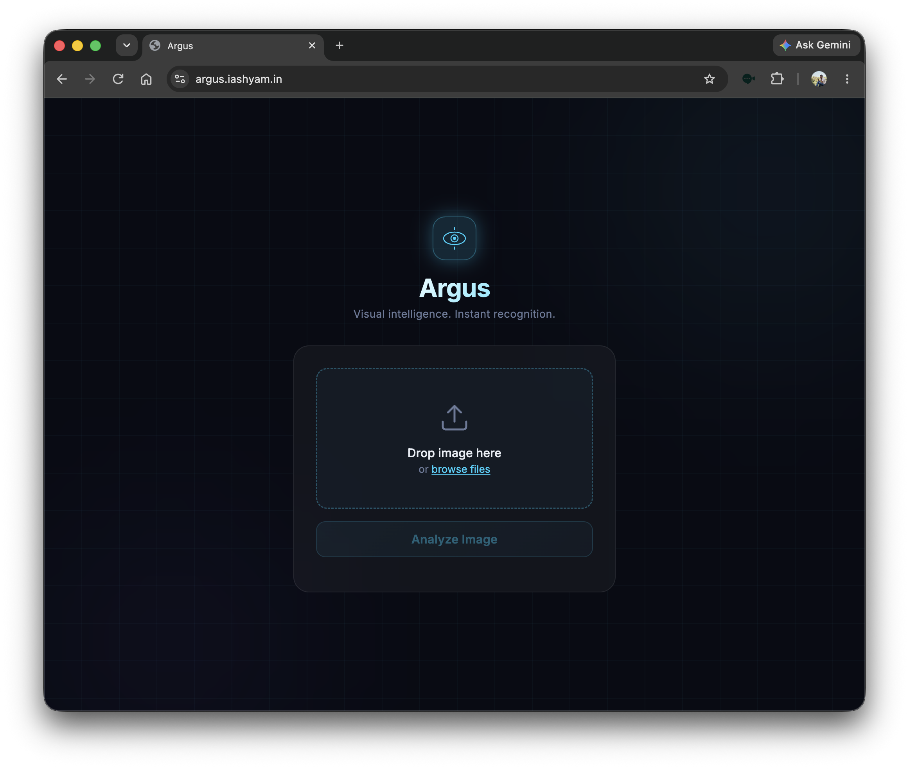

# Argus: Visual Intelligence at your hand

A from-scratch implementation of vision models for image classification, served via a Flask API and deployed at **[argus.iashyam.in](https://argus.iashyam.in)**.

## What it does

Upload any image, get a classification label from 1000 ImageNet categories. The backend runs custom-trained vision models built entirely in PyTorch — no pretrained backbone dependencies at inference time.



## Models

| Model | Paper | Weights |
|-------|-------|---------|
| **SimpleCNN** | Custom architecture | Trained on CIFAR-100 |
| **MobileNet V2** | [MobileNetV2: Inverted Residuals and Linear Bottlenecks](https://arxiv.org/pdf/1801.04381) | `burrah_mobilenet_v1.pth` |

Both models are implemented from scratch in `src/models/`.

## Stack

- **Framework**: PyTorch + Flask
- **ETL**: Custom `ImageDataset` pipeline (`src/ETL/`)
- **Training**: `Trainer` class with train/eval loops, tqdm progress (`src/Train/`)
- **Experiment tracking**: MLFlow
- **CI**: GitHub Actions (lint + pytest on push to `main`)
- **Deployment**: Docker + Cloudflare Tunnel

## Project structure

```
src/
  models/     # SimpleCNN and MobileNet V2 implementations
  ETL/        # Dataset loading and preprocessing
  Train/      # Training loop (Trainer class)
  utils/      # ImageNet 1000-class label map
  weights/    # Saved model weights
Data/         # CIFAR-10 and CIFAR-100 datasets
tests/        # pytest test suite
```

## Run locally

### Docker (recommended)

```bash
cp .env.example .env
# Add your CLOUDFLARE_TUNNEL_TOKEN to .env (optional, only needed for tunnel)

docker compose up
```

App runs at `localhost:5911`.

### From source

```bash
pip install .
# run the Flask app
python -m app
```

## Train a model

```python
from src.Train.train import Trainer
import torch

trainer = Trainer(model, criterion, optimizer, device=torch.device("cuda"))
history = trainer.train_loop(n_epochs=20, train_dataloader=..., test_dataloader=...)
```

## Data

CIFAR-10 and CIFAR-100 batches are in `Data/`. To download:

```bash
python Data/Download.py
```

## Roadmap

- [x] Containerize the model with Docker.
- [x] Put automated testing with github actions.
- [ ] Deploy the model to server.
- [x] Write a ETL pipeline.
- [x] Write training loop.
- [ ] Write documentation for ETL.
- [x] Use ML Flow for experiment tracking
- [ ] User DVC pipelines.
- [ ] Run some basic experiments.

## Contributing

Personal project, not accepting contributions right now. EfficientNet is next.
